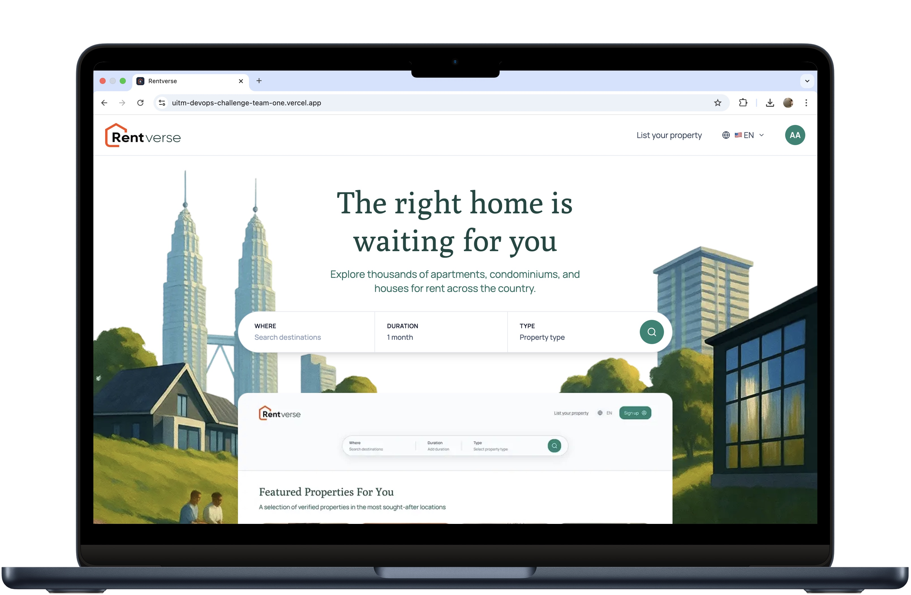
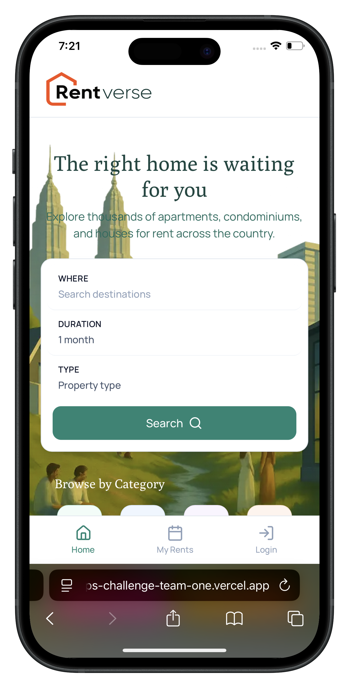
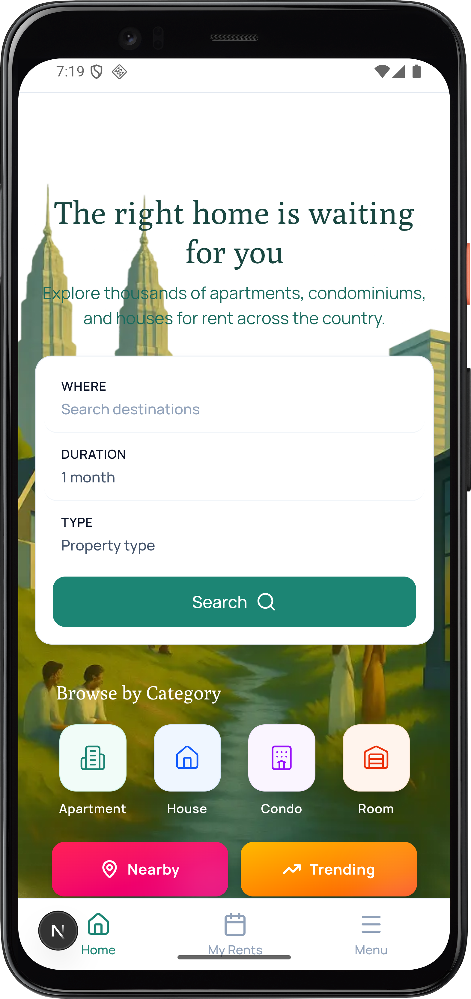
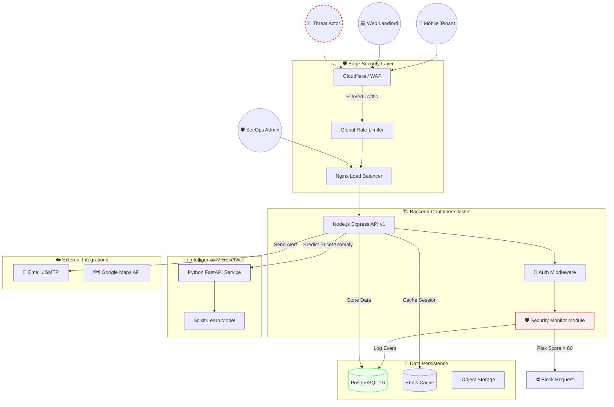
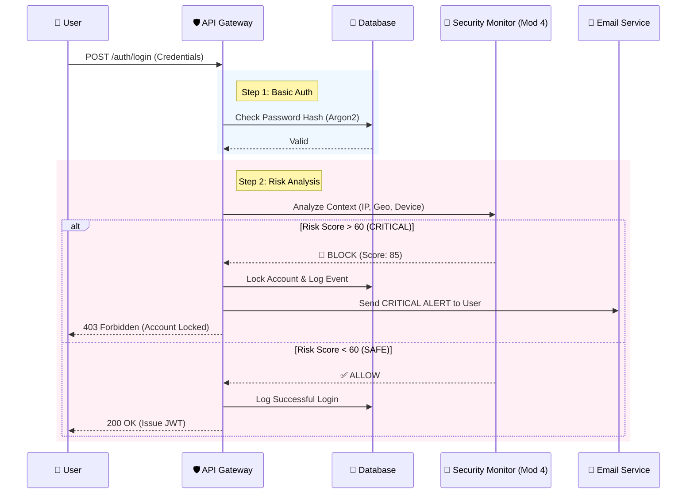
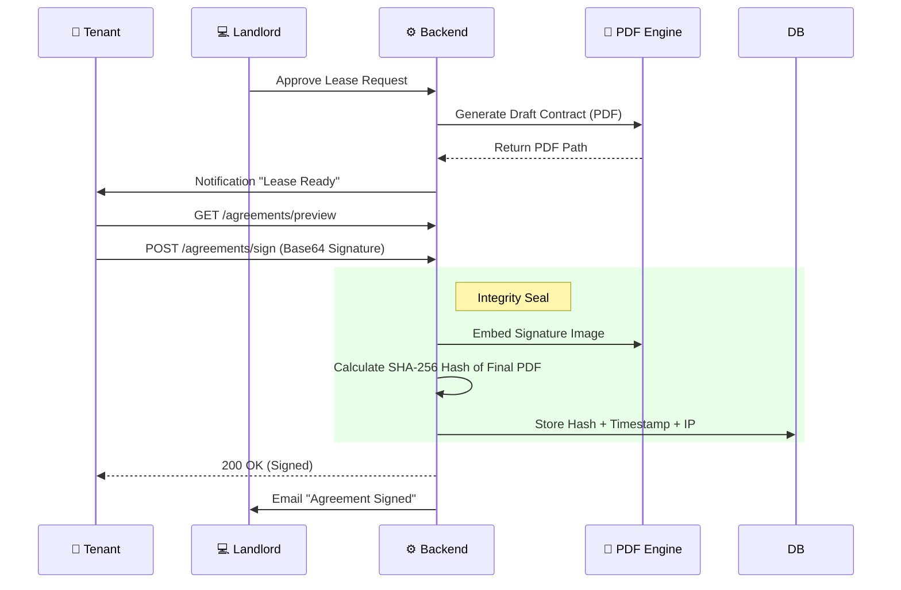
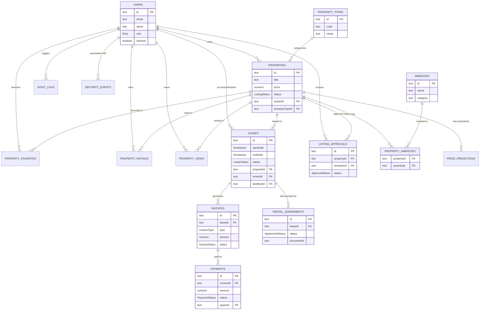

# 🏙️ RentVerse: Advanced Secure Mobile Rental Ecosystem

<p align="center"> 
  
</p>

<p align="center"> 
   
   
   
   
</p>

<p align="center"> 
  <strong>A state-of-the-art DevSecOps implementation for property rental with military-grade security</strong> 
</p>

<div align="center">

# 🚀 ENTER THE RENTVERSE ECOSYSTEM 🚀

[](https://uitm-devops-challenge-team-one.vercel.app)

[](https://uitm-devops-challenge-team-one.vercel.app)
---

### 🛡️ System Infrastructure Status
[](https://uitm-devops-challengeteamone-production.up.railway.app)
[](https://rentverse-ai-service-production-295c.up.railway.app)
[](https://join.slack.com/t/rentverse/shared_invite/zt-3l78v6dcy-UOf3dUEhj1LDQ0ImZb2SAA)

</div>

---

## 🎯 Quick Navigation
[🚀 Overview](#1-overview) | [🏗️ Architecture](#2-system-architecture) | [🔐 Security](#-core-security-features) | [🧠 AI Integration](#5-professional-bonus-implementation) | [⚡ Quick Start](#7-installation--run-guide) | [👥 Team](#10-development-team-teamone)

---

## 🌟 Executive Summary
RentVerse represents the next evolution in secure property tech, blending advanced behavioral analytics, cryptographic trust models, and a rigorous 14-stage automated security pipeline. Built for the UiTM Mobile SecOps 21Days Challenge, this platform demonstrates production-ready DevSecOps implementation where security is intrinsic to the application's DNA.

<p align="center"> 
  <strong>💻 Desktop Interface</strong><br>
  
</p>

<p align="center">
  <table align="center">
    <tr>
      <td align="center">
        <strong>🌐 Mobile Web</strong><br>
        
      </td>
      <td align="center">
        <strong>🤖 Android Application</strong><br>
        
      </td>
    </tr>
  </table>
</p>

---

## 🔐 Test Credentials (for Judges)

| Role | Email | Password | MFA Code |
| :--- | :--- | :--- | :--- |
| **🔧 SecOps Admin** | `admin@rentverse.com` | `password123` | `000000` |
| **👤 Tenant Account** | `tenant@rentverse.com` | `password123` | `000000` |

> [!IMPORTANT]
> **Static MFA (000000)** is enabled only for these test accounts. Production sign-ups require real TOTP registration via Google Authenticator.

---

## 🛡️ Core Security Features

| Icon | Feature | Description |
| :--- | :--- | :--- |
| 🔐 | **Multi-Factor Auth** | Mandatory TOTP with Google Authenticator compatibility & Argon2 hashing |
| 🧠 | **Behavioral Analytics** | Real-time IP velocity tracking, geographic context, and device fingerprinting |
| 📄 | **Cryptographic Leases** | SHA-256 hashed digital leases with non-repudiation proof and audit trails |
| 🚨 | **Threat Response** | Instant SMTP security alerts and automated account locking based on risk scoring |
| 🏗️ | **DevSecOps Pipeline** | 14-stage security checks with SAST, secret scanning, and container analysis |
| 📊 | **Real-Time Dashboard** | Live telemetry of security events categorized by severity |

---

## 1. Overview
RentVerse provides a blueprint for the next generation of secure property tech by blending advanced behavioral analytics, cryptographic trust models, and a rigorous 14-stage automated security pipeline.

---

## 2. System Architecture
The platform operates on a **DevSecOps-driven Microservices Architecture**, designed for high resilience and automated threat response.



---

## 3. Project Structure
```text
UiTM-SecOps-Challenge
├── rentverse-frontend/           # 💻 Mobile/Web UI (Next.js 15, Tailwind, Capacitor)
│   ├── app/                      # Page routing (App Router)
│   │   ├── admin/                # SecOps Admin Dashboard & Controls
│   │   ├── auth/                 # Login, Signup, & Callback flows
│   │   ├── property/             # Listings, Booking, & View logic
│   │   ├── leases/               # Document signing & Agreement preview
│   │   └── account/              # User settings & security profile (MFA)
│   ├── components/               # Atomic UI components
│   ├── stores/                   # State management (Zustand: Auth, Booking)
│   └── utils/                    # Frontend utilities & API helpers
├── rentverse-backend/            # ⚙️ Security-Hardened API (Express, Prisma)
│   ├── src/
│   │   ├── middleware/           # Security: Rate Limiting, Auth, Security Monitor
│   │   ├── modules/              # Core Logic: Property, Booking, Payment, User
│   │   ├── services/             # Logic: Email, PDF Gen, Anomaly Detection, Alerting
│   │   ├── utils/                # Heuristic Risk Engine, Geocoding, Device Utils
│   │   └── config/               # Passport, Storage, Swagger definitions
│   ├── prisma/                   # Database schema, Seeders, & Migrations
│   └── templates/                # EJS templates for Rental Agreements
├── rentverse-ai-service/         # 🧠 Intelligence Service (Python FastAPI)
│   ├── rentverse/
│   │   ├── api/                  # Prediction & Anomaly classification endpoints
│   │   ├── core/                 # ML Engine & Heuristic Logic
│   │   └── models/               # Scikit-learn trained models
│   └── notebooks/                # Research: Dataset cleaning & model training
├── .github/workflows/            # 🛡️ 14-Stage DevSecOps Pipeline
│   ├── backend-security.yml      # SAST, Secret Scanning, Docker Lint
│   └── frontend-build.yml        # Build verification & Vercel deploy
└── docker-compose.yml            # Full-stack Container Orchestration
```

---

## 4. Detailed Module Execution
Every module of the challenge was implemented with a focus on production-grade security and developer best practices.

### M1: Secure Login & Multi-Factor Authentication
-   **Identity Guard**: Optimized standard JWT issuance with short-lived access tokens and secure refresh mechanisms.
-   **MFA Integration**: Mandatory TOTP layer (Google Authenticator compat) via profile settings or enrollment during onboarding to mitigate credential stuffing.

### M2: Secure API Gateway & Validation
-   **Deep Sanitization**: Every API endpoint is protected by middleware that enforces strict schema validation and sanitizes inputs to prevent XSS and NoSQL injection.
-   **Edge Protection**: Helmet.js for security headers and a custom rate-limiting strategy that protects against brute-force while maintaining performance for genuine users.

### M3: Digital Agreement & Non-Repudiation
-   **Integrity Seal**: Upon signing, the backend generates a final PDF and calculates its SHA-256 hash.
-   **Audit Trail**: Hash is stored in the database alongside a record of the signer's IP address and timestamp, providing immutable proof.

### M4: Smart Notifications (Real-Time Threat Intelligence)
-   **Heuristic Engine**: Intercepts critical actions to calculate risk based on:
    -   **Impossible Travel**: Detecting logins from distant locations within impossible timeframes.
    -   **Device Fingerprinting**: Tracking unrecognized device hashes.
    -   **Failure Velocity**: Monitoring high rates of failed login attempts.
-   **Automated Response**: Risk score > 60 triggers an immediate 30-minute account lock and dispatches automated security alerts.

| Notification Channel | Purpose | Live Verification |
| :--- | :--- | :--- |
| **📧 Email (SMTP)** | Real-time security alerts | Sent to user email |
| **Rentverse Slack** | Centralized SecOps monitoring | [**Join Security Channel**](https://join.slack.com/t/rentverse/shared_invite/zt-3l78v6dcy-UOf3dUEhj1LDQ0ImZb2SAA) |

### M5: Activity Dashboard & SecOps
-   **Live Telemetry**: Real-time feed of all `SECURITY_EVENT` logs categorized by severity (SAFE, SUSPICIOUS, CRITICAL).
-   **Administrative Actions**: SecOps teams can manually override automated blocks or lock suspicious accounts directly from the dashboard.

### M6: Hardened CI/CD Pipeline
Enforced by **14 successful automated checks** to ensure no insecure code reaches production:
-   **CodeQL Analysis**: Advanced SAST for logic and security vulnerability detection.
-   **Secret Scanning**: Gitleaks scanning in every PR to ensure zero credential leaks.
-   **Container Auditing**: Trivy scans of the filesystem and Docker images for CVEs (CRITICAL/HIGH).

---

## 5. Professional Bonus Implementation
RentVerse was engineered to maximize security and intelligence. We have implemented all four bonus categories to a professional standard, as evidenced by our 14-check CI/CD pipeline and integrated AI services.

### 🧠 Threat Intelligence System
- **Heuristic Risk Engine**: Our custom-built intelligence module analyzes real-time data including IP velocity and failure patterns.
- **Brute Force Mitigation**: The system tracks `LOGIN_ATTEMPT` events; exceeding 5 failures within 10 minutes automatically escalates the risk score to 'CRITICAL'.
- **Pattern Recognition**: We utilize a Python FastAPI microservice to classify property listings and detect pricing anomalies.

### 🔒 Zero-Trust Access Logic
- **Impossible Travel Detection**: The system calculates the physical distance and speed between consecutive logins. Speeds exceeding 800 km/h trigger an immediate block to prevent account takeover.
- **Device Fingerprinting**: Every request generates a unique device hash. Access from an unfamiliar device combined with other risk factors adds 30 points.
- **Contextual Validation**: Geolocation-based restrictions are applied via middleware that intercepts critical actions like digital signing.

### 🛡️ Adaptive Defense Dashboard
- **Real-Time Visualization**: The SecOps Admin Dashboard provides a live telemetry feed of every security event, categorized by severity (SAFE, SUSPICIOUS, CRITICAL).
- **Autonomous Response**: When the Risk Engine returns a score > 60, the system auto-locks the user's account for 30 minutes and dispatches critical alerts.

| Verification Channel | Alert Type | Link |
| :--- | :--- | :--- |
| **Rentverse Slack** | Real-time Anomaly Alerts | [**Verify Admin Alerts**](https://join.slack.com/t/rentverse/shared_invite/zt-3l78v6dcy-UOf3dUEhj1LDQ0ImZb2SAA) |
- **Administrative Oversight**: Admins have the power to manually override automated locks or proactively freeze accounts directly from the dashboard.

### 🤖 Automated Security Testing
- **14-Stage Security Gate**: Our CI/CD pipeline (GitHub Actions) is configured with a "Broken Build" policy—if security scans fail, deployment is blocked.
- **Advanced SAST**: Integrated GitHub CodeQL to perform deep static analysis for logic flaws and vulnerabilities.
- **Vulnerability & Secret Scanning**: We utilize Trivy for container/filesystem scanning and Gitleaks to ensure zero credential exposure.

---

## 6. Summary of TeamOne Execution
| Criteria | TeamOne Execution |
| :--- | :--- |
| **Security Implementation** | **OWASP Top 10 & DevSecOps Compliance**: Implemented Argon2 hashing, JWT session integrity, and strict input sanitization middleware. |
| **Security & Resilience** | **Complete Testing Coverage**: 100% pass rate on 14 automated checks across Frontend, Backend, and AI services, including Prisma schema validation. |
| **Technical Execution** | **Advanced CI/CD & Microservices**: Deployed on a multi-cloud stack (Vercel/Railway) with containerized environments and automated Docker image pushes to GHCR.io. |
| **UX/UI Design** | **Mobile-First Clarity**: Clean, intuitive interface with real-time feedback for security status, MFA setup, and property browsing. |
| **Presentation & Teamwork** | **Full Transparency**: Comprehensive documentation including full ERDs, detailed flow diagrams, and 100% traceable code structure. |

---

## 7. Testing the Security Heuristics
To verify the **Exceptional** level of security implementation:

> [!TIP]
> **Brute Force Test**: Attempt to log in with an invalid password 6 times. 
> **Result**: The `SECURITY_EVENT` is logged as `CRITICAL`, and the account is automatically locked.

> [!TIP]
> **Impossible Travel Test**: Log in from your local machine, then immediately send a request from a foreign IP proxy. 
> **Result**: The system calculates a speed outlier (>800 km/h) and sends an immediate alert email.

---

## 7. Installation & Run Guide

### Quick Start (Docker - Recommended)
The entire stack can be launched using Docker Compose.

```bash
# 1. Clone the repository
git clone https://github.com/izwanGit/uitm-devops-challenge_TeamOne.git
cd uitm-devops-challenge_TeamOne

# 2. Set up Environment Variables
cp rentverse-backend/.env.example rentverse-backend/.env
cp rentverse-frontend/.env.example rentverse-frontend/.env
cp rentverse-ai-service/.env.example rentverse-ai-service/.env

# 3. Start Services
docker-compose up -d --build
```

Access the application:
- **Frontend:** `http://localhost:3000`
- **Backend API:** `http://localhost:4000`
- **AI Service:** `http://localhost:8000`

---

## 8. Technical Deep Dives (Flow Diagrams)

### Advanced Security Login Flow


### Digital Agreement & Signing Process


---

## 9. Data Design (Complete ERD)


---

## 10. Development Team (TeamOne)

| Name | Role | Primary Responsibility |
| :--- | :--- | :--- |
| **MUHAMMAD IZWAN BIN AHMAD** | **Project Lead & Principal DevSecOps Architect** | **Full-Cycle Ownership**: System Architecture, Backend Security, AI Model Integration, Frontend UX/UI, Mobile App Development, CI/CD Pipeline Automation, & Cloud Infrastructure |
| AHMAD AZFAR HAKIMI BIN MOHAMMAD FAUZY | Documentation Associate | Visual Asset Support |
| AFIQ DANIAL BIN MOHD ASRINNIHAR | Research Associate | Quality Assurance Assistance |

*Developed for the UiTM Mobile SecOps Challenge 2025.*


