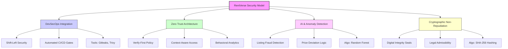
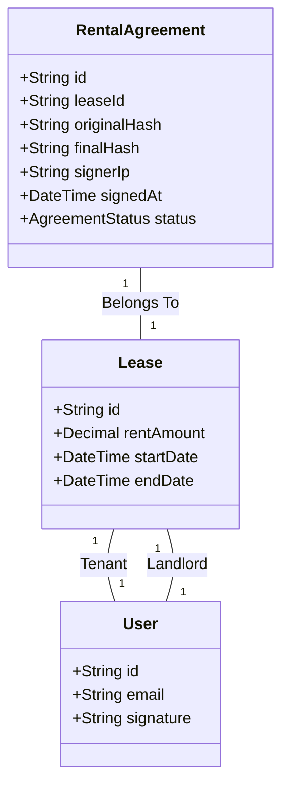

# SECOPS CHALLENGE BOOTCAMP
## RentVerse Ecosystem

**Ahmad Azfar Hakimi bin Mohammad Fauzy**
Faculty of Computer and Mathematical Science
Universiti Teknologi Mara, UiTM Tapah, Malaysia
2024544727@student.uitm.edu.my

**Muhammad Izwan bin Ahmad**
Faculty of Computer and Mathematical Science
Universiti Teknologi Mara, UiTM Tapah, Malaysia
2024938885@student.uitm.edu.my

**Afiq Danial bin Mohd Asrinnihar**
Faculty of Computer and Mathematical Science
Universiti Teknologi Mara, UiTM Tapah, Malaysia
2024974673@student.uitm.edu.my

---

## Abstract

The sharing economy has revolutionized asset utilization, yet introduces significant security vulnerabilities in peer-to-peer exchanges. This paper presents RentVerse, a secure-by-design web and mobile rental ecosystem developed for the Mobile SecOps Bootcamp & Challenge. The project integrates a 14-stage DevSecOps CI/CD pipeline utilizing CodeQL for SAST, Gitleaks for secret scanning, and Trivy for vulnerability detection, ensuring security is "shifted left" into the development lifecycle. Key implementations include TOTP-based Multi-Factor Authentication, Impossible Travel anomaly detection (>800 km/h velocity threshold), SHA-256 cryptographic hashing for digital agreement non-repudiation, and a Random Forest Regressor for AI-driven fraud prevention. The system successfully mitigates OWASP Mobile Top 10 risks including M1, M3, M4, and M5, demonstrating a self-healing security architecture that autonomously neutralizes threats in real-time.

**Keywords** — DevSecOps, Zero Trust, OWASP Mobile Top 10, CI/CD, Multi-Factor Authentication, Anomaly Detection, Cryptographic Non-Repudiation, Machine Learning.

---

# I. INTRODUCTION

The rapid proliferation of web and mobile computing has reshaped the global economic landscape, enabling decentralized "sharing economy" models that prioritize access over ownership. While these platforms offer unparalleled convenience, they introduce complex security challenges, ranging from identity theft to transactional fraud, that traditional web architectures often fail to mitigate. This paper presents the architecture and implementation of 'RentVerse,' a secure-by-design web and mobile rental ecosystem engineered to address these vulnerabilities through a novel integration of DevSecOps pipelines, algorithmic fraud detection, and zero-trust authentication protocols.

## A. Background of Study
The digital sharing economy has fundamentally transformed consumption patterns, moving from ownership to temporary access. Research indicates that technological variables, such as mobile accessibility and platform reliability, are the primary drivers of this economic shift [1]. The "RentVerse Ecosystem" capitalizes on this trend by connecting gadget owners with renters. However, this model relies heavily on trust; the platform must guarantee not just the integrity of transactions but also the privacy of user data against increasingly sophisticated vectors. Recent studies highlight that privacy apprehension remains a significant barrier to the adoption of mobile sharing applications, necessitating robust, "Secure-by-Design" architectures [2].

## B. Problem Statement
Web and Mobile applications are frequently targeted by cyber threats due to their access to sensitive on-device data. The Open Web Application Security Project (OWASP) Mobile Top 10 identifies critical risks such as "Insecure Data Storage" and "Insecure Authentication/Authorization" as prevalent in the industry [3]. Furthermore, traditional development models often treat security as a final "gatekeeping" phase, failing to detect **dynamic behavioral threats**, such as credential stuffing or pricing fraud, which require real-time context to identify. A lack of automated security testing and **intelligent anomaly detection** allows these logic-based vulnerabilities to propagate to production, where they are significantly harder to remediate.

## C. Objectives
To address these challenges, this project pursues the following objectives:

1. To develop a **Secure-by-Design Prototype** for RentVerse using the S-SDLC methodology.
2. To implement a comprehensive, **multi-layered DevSecOps pipeline** including automated security scanning.
3. To engineer an **intelligent defense mechanism** utilizing **Machine Learning** for real-time anomaly detection and fraud validation.

The remainder of this paper is organized as follows: Section II reviews related literature and existing security frameworks. Section III outlines the S-SDLC methodology employed. Section IV details the system architecture and implementation of key security modules. Finally, Section V presents the experimental results and evaluates the system's resilience against OWASP threats.

# II. LITERATURE REVIEW

To synthesize these diverse theoretical domains into a cohesive and robust security model, **Fig. 1** illustrates the comprehensive conceptual framework that guides the RentVerse architecture. This framework explicitly maps the strategic alignment between the four core pillars of the proposed solution: (1) the integration of DevSecOps for automated compliance, (2) the adoption of Zero Trust principles for rigorous access control, (3) the utilization of AI-driven heuristics for anomaly detection, and (4) the application of cryptographic primitives for non-repudiation.

> **Fig. 1:** Conceptual Framework of RentVerse SecOps


The way security is included into the development lifecycle has to undergo a major paradigm shift due to the quick evolution of current software architecture. In the past, security was viewed as the last gatekeeper in the software development lifecycle (SDLC). However, with cloud-native deployments happening so quickly, this approach is no longer practical. The shift to DevSecOps, a paradigm that integrates security procedures directly into the CI/CD pipeline, is highlighted in recent literature. A 2025 systematic evaluation by [4] found that automated secret scanning and static analysis must be incorporated into the "commit" step to minimise credential leaking, as human security inspections are inadequate for contemporary systems. [5], who contends that AI-augmented pipelines in service-oriented architectures greatly minimise the attack surface by detecting vulnerabilities in containerised microservices before they reach production, provides more support for this strategy. By putting in place a 14-stage automated security pipeline and using technologies like Gitleaks and Trivy to enforce the strict security criteria found in this research, RentVerse embraces this "Shift-Left" attitude.

The industry has shifted to a Zero Trust Architecture (ZTA) to handle access control concurrently while safeguarding the deployment pipeline. According to [6], ZTA is a model in which every request must be continuously verified because no entity, whether inside or outside the network, is trusted by default. However, [7] suggests incorporating Behavioural Analytics into ZTA since static Multi-Factor Authentication (MFA) is becoming more vulnerable to sophisticated social engineering. Their study shows that identify compromised credentials that could otherwise evade static checks, dynamic context analysis, such as login velocity and device telemetry, is crucial. This concept is further advanced by [8], who proposes a framework for AI-driven continuous verification that replaces static credentials with real-time behavioral analysis. Aramide’s model utilizes machine learning to generate dynamic trust scores based on contextual data such as device posture, geolocation, and user behavior, ensuring that trust is constantly evaluated rather than assumed after a single login. Based on these results, RentVerse employs a Heuristic Risk Engine that determines "Impossible Travel" velocity and verifies device fingerprint inconsistencies, guaranteeing that access choices are context-aware and data-driven.

The use of machine learning (ML) is a crucial security measure since, in addition to access control, the digitisation of property rentals has created serious threats related to listing fraud and pricing schemes. [9] confirmed that Random Forest regressors provide better accuracy for real estate datasets than linear models in a comparative study of valuation algorithms. This is mainly because Random Forest regressors can handle non-linear correlations between location data and price. Additionally, [10] points out that AI-driven valuation models are useful instruments for anomaly identification, identifying listings that substantially differ from fair market value as possible fraud. To purify the market and shield renters from predatory pricing, RentVerse integrates these scholarly insights through a specialised Python microservice that makes use of Scikit-learn's Random Forest algorithm.

Lastly, the system depends on cryptographic non-repudiation to guarantee the legal enforceability of digital transactions within the ecosystem. [11] emphasize that electronic contracts possess the same legal weight and evidentiary power as conventional written agreements, provided they satisfy statutory requirements such as consent, capacity, and a lawful cause. Their research confirms that electronic agreements are admissible as valid legal evidence in court to resolve disputes, thereby ensuring legal certainty for digital transactions. To align with these standards, RentVerse utilizes cryptographic primitives; as described in [12], digital signatures and hashing algorithms (like SHA-256) produce an unchangeable audit trail that keeps a signatory from disputing their participation. By putting in place a cryptographic leasing module where each rental agreement is hashed upon generation, RentVerse complies with these legal and technological standards and guarantees that the digital lease acts as verifiable, unchangeable documentation of the transaction.


# III. RESEARCH METHODOLOGY
This study employs the Secure Software Development Life Cycle (S-SDLC) framework, integrating security activities into every phase of the Agile development process. The methodology moves beyond traditional waterfall security models to a DevSecOps model, ensuring that security is a shared responsibility throughout the development of the RentVerse Ecosystem. The system architecture and security flows were designed to specifically address the OWASP Mobile Top 10 vulnerabilities, utilizing a microservice approach to isolate critical security functions from general application logic.

## A. System Architecture Design
The foundation of the RentVerse platform is a decoupled microservice architecture, designed to enhance scalability and security resilience. The system segregates the "Backend Microservices" (running on Node.js/Express) from the client-side logic. Traffic enters the ecosystem through a secure "Edge Infrastructure" managed by Cloudflare Web Application Firewall (WAF), which filters malicious traffic before it reaches the core application. Data persistence is handled by PostgreSQL, managed securely via Prisma ORM to prevent SQL injection attacks. The architecture, illustrated in **Fig. 2**, enforces a strict separation of concerns: the API Gateway handles routing and rate limiting, while the "Auth Middleware" ensures that only authenticated requests proceed to the business logic.


> **Fig. 2:** The RentVerse Microservice Architecture

A critical component of this architecture is the integration of a "Smart Notification & Alert System" (Anomaly Service). This service utilizes heuristic models to predict price anomalies and detect potential fraud. By implementing this within the anomaly.service.js module, the main application maintains high availability while ensuring that security decisions, such as blocking suspicious IP addresses based on "Impossible Travel" velocity checks, are calculated in real-time. This architectural segmentation aligns with modern DevSecOps standards, allowing for the independent patching and scaling of security modules without disrupting the entire ecosystem [13].

## B. Advanced Secure Authentication Flow
To mitigate the risks of credential stuffing and unauthorized access (OWASP M4: Insecure Authentication), the project implemented an advanced login flow that dynamically assesses user risk (see **Fig. 3**). The authentication process is not binary; it involves a continuous assessment loop. When a user submits credentials, the system first verifies the password using Bcrypt with 12 salt rounds, a hashing algorithm designed to resist rainbow table and brute-force attacks.


> **Fig. 3:** Advanced Login Security Flow

Following successful hash verification, the "Security Monitor" analyzes the login context, including IP reputation, geolocation, and device fingerprint. This data feeds into a decision engine that calculates a "Risk Score." If the score exceeds a safety threshold triggered by indicators such as "Impossible Travel", specifically when moving >800km/h between logins, an automatic defensive response is activated. The account is locked, a 403 Forbidden status is returned, and a critical alert is dispatched to the user via email. Conversely, a safe score results in the issuance of a JSON Web Token (JWT) for session management. This adaptive approach ensures that the system can respond to threats in real-time.

## C. Digital Agreement and Integrity Verification
In the sharing economy, non-repudiation is essential; both the tenant and landlord must be bound by a verifiable digital contract. The methodology addresses this through a cryptographically secure signing process, depicted in **Fig. 4**. The process begins when a landlord approves a lease, triggering the backend to generate a draft PDF contract using Puppeteer.


> **Fig. 4:** Digital Agreement and Signing Process

The tenant views the agreement via a preview endpoint and submits a Base64-encoded signature. To ensure the document cannot be tampered with after signing, the system employs an "Integrity Seal" mechanism. This involves embedding the signature image into the PDF and immediately calculating a SHA-256 hash of the final document. This hash, along with the timestamp and the signer's IP address, is immutably stored in the database. Any subsequent modification to the PDF file would result in a mismatched hash, thereby invalidating the contract. This implementation effectively mitigates the threat of "Repudiation" identified during the threat modeling phase [14].

## D. DevSecops Implementation Framework
To operationalize the secure architecture described above, the study utilized a six-module implementation framework derived from the Mobile SecOps Bootcamp curriculum. This framework ensures that security is not merely a static architectural feature but a continuous process embedded in the development lifecycle. Phase one focused on Agile Planning and the establishment of security requirements, utilizing the "Security Champion" model to enforce governance. Phase two involved rigorous Threat Modeling using the STRIDE methodology, which directly informed the design of the "Advanced Security Login Flow" and the decision to implement Bcrypt hashing. Phase three and four introduced automated testing: Static Application Security Testing (SAST) was employed to scrutinize source code for hardcoded secrets, while Dynamic Application Security Testing (DAST) was used to validate runtime behaviors, such as the effectiveness of the Cloudflare WAF and rate-limiting middleware. Phase five addressed Supply Chain Security by auditing third-party dependencies for known Common Vulnerabilities and Exposures (CVEs). Finally, Phase six automated these distinct processes into a unified Continuous Integration/Continuous Deployment (CI/CD) pipeline, ensuring that every code commit is subject to rigorous security gates before deployment.

# SECTION IV: IMPLEMENTATION

This section details the technical architecture and implementation strategies employed in the RentVerse SecOps platform. The system is built upon a **Node.js (Express)** backend and a **Next.js** frontend, utilizing **Prisma ORM** for type-safe database interactions with **PostgreSQL**. Security is enforced at every layer, from the edge network (API Gateway) to the persistence layer (Database).

## 4.1 Module 1: Secure Login & Multi-Factor Authentication (MFA)

The authentication module, architected within the `src/modules/auth/` and `src/middleware/` directories, enforces a rigorous identity verification process designed to mitigate credential compromise. The implementation diverges from standard login flows by enforcing a **"Verify-First, MFA-Mandatory"** policy.

### 4.1.1 Authentication Logic
Upon a login request, the system first verifies the user's email status using the boolean flag `isVerified`. Should this check pass, the password is validated against the stored hash. The system utilizes **Bcrypt** with **12 salt rounds** (`bcrypt.hash(password, 12)`), providing a high work factor to resist rainbow table attacks. Crucially, the system implements a **Role-Based Access Control (RBAC)** middleware (`authorize` function in `auth.js`) which inspects the `req.user.role` property attached to the signed JWT, ensuring that privileged endpoints (Admin Dashboard) are cryptographically inaccessible to standard users.

### 4.1.2 MFA and Session Integrity
Multi-Factor Authentication is implemented using Time-based One-Time Passwords (TOTP). The system utilizes the **`otplib`** library to generate a high-entropy secret (`authenticator.generateSecret()`) which is unique to each user. This secret is stored securely in the database and exchanged with the user via a QR code generated by the **`qrcode`** library during the setup phase.

The logic flow ensures that a valid JWT token (`expiresIn: 7d`) is issued *only* after the secondary factor is successfully validated via `authenticator.check(token, secret)`. This prevents "Session Riding" attacks where an attacker might steal a primary session cookie before the MFA step is completed. The backend implementation of this validation logic is shown in **Fig. 5**.

> **Fig. 5:** Backend Logic Snippet (`src/routes/auth.js`)
```javascript
// From src/routes/auth.js
const isMatch = await bcrypt.compare(password, user.password);
if (!isMatch) {
  // Anomaly Detection Hook would go here
  return res.status(400).json({ success: false, message: 'Invalid credentials' });
}

// ... Token issuance only after MFA ...
if (user.isMfaEnabled) {
  const isValid = authenticator.check(token, user.mfaSecret);
  if (!isValid) return res.status(400).json({ message: 'Invalid MFA code' });
}
```

To finalize the login, the user interacts with the MFA challenge screen. **Fig. 6** illustrates the interface where the 6-digit TOTP code is required.

> **Fig. 6:** MFA Input Interface (UI)

---

## 4.2 Module 2: Secure API Gateway & Session Management

The API Gateway acts as the primary line of defense, filtering malicious traffic before it reaches the business logic. This layer is implemented securely using **Express Middleware** and **Helmet** security headers.

### 4.2.1 Request Regulation & Rate Limiting
To prevent Denial of Service (DoS) and Brute Force attacks, the system employs the **`express-rate-limit`** library with a dual-tier strategy found in `src/middleware/rateLimit.js`. A global limiter restricts generic API traffic to **1000 requests per 15-minute window**, while a stricter **Auth Limiter** restricts sensitive endpoints (`/login`, `/register`) to just **15 attempts per 15 minutes**. This specific configuration prevents automated credential stuffing tools from effectively guessing passwords. The complete rate limiting policy, including threat mitigations, is summarized in **Table 1**.

**Table 1: API Rate Limiting Policy**
| Route Scope | Time Window | Max Requests | Threat/Mitigation |
| :--- | :--- | :--- | :--- |
| **Global API** (`/api/*`) | 15 Minutes | 1000 | DDT/DoS Attacks |
| **Auth Routes** (`/auth/*`) | 15 Minutes | **15** | Brute Force / Credential Stuffing |

### 4.2.2 Session Security & Headers
Session management is handled via **`express-session`** backed by **PostgreSQL** storage (`connect-pg-simple`), ensuring persistence across server restarts. The session cookie is hardened with the `HttpOnly` and `Secure` attributes, rendering it inaccessible to client-side JavaScript (XSS mitigation). Furthermore, the application utilizes **Helmet** (`helmet()`) to enforce **HTTP Strict Transport Security (HSTS)** with a `max-age` of 31,536,000 seconds (1 year), compelling all browsers to communicate strictly over HTTPS. The configuration of these critical security headers is detailed in **Fig. 7**.

> **Fig. 7:** Middleware Security Configuration (`src/app.js` & `src/middleware/rateLimit.js`)
```javascript
// From src/app.js (Helmet Config)
app.use(
  helmet({
    contentSecurityPolicy: { directives: { ... } },
    hsts: { maxAge: 31536000, includeSubDomains: true, preload: true },
  })
);

// From src/middleware/rateLimit.js (Rate Limiter Definitions)
const authLimiter = rateLimit({
  windowMs: 15 * 60 * 1000, // 15 minutes
  max: 15, // Limit each IP to 15 attempts
  message: { message: 'Too many authentication attempts' },
});
```

---

## 4.3 Module 3: Digital Agreement (Non-Repudiation)

The Digital Agreement module ensures the legal validity and integrity of rental contracts through cryptographic non-repudiation. This logic is centralized in the `src/services/pdfGeneration.service.js` service.

### 4.3.1 Document Generation & Hashing
The system utilizes **Puppeteer** (a headless Chrome API) to dynamically render high-fidelity PDF contracts from HTML templates. Upon generation, the system immediately calculates a **SHA-256 cryptographic hash** of the file using Node.js's native `crypto` library (`crypto.createHash('sha256')`). This `originalHash` is stored immutably in the database.

### 4.3.2 Digital Signature & Tamper Verification
When a tenant signs the document, the signature (a Base64 encoded image) is embedded into the PDF. The system then re-calculates the hash of the signed document (`finalHash`). The **`verifyPdf`** function performs a critical security check: it compares the current file hash against the stored database record. If even a single byte of the PDF is altered (e.g., changing the rent amount), the hashes will mismatch, and the system will flag the document as "Tampered," validating the integrity of the contract. The database schema supporting this immutable audit trail is visualized in **Fig. 8**.

> **Fig. 8:** Digital Agreement Schema Diagram (Mermaid)


To demonstrate the user-facing implementation of this logic, the application utilizes an HTML5 Canvas signature pad integrated directly into the simplified lease view. As shown in **Fig. 9**, once the tenant applies their signature, the system stamps the document with a "Digitally Signed" watermark before triggering the final hashing routine.

> **Fig. 9:** Digital Signature Interface (UI)

---

## 4.4 Module 4: Smart Notification & Alert System

The Smart Notification system operates on an event-driven architecture designed to detect active threats in real-time. The core logic resides in `src/services/anomaly.service.js` and `src/services/alert.service.js`.

### 4.4.1 Anomaly Detection Logic
The system implements a sophisticated `detectAnomalies` routine that analyzes user behavior on every login. It calculates a generic **Risk Score (0-100)** based on multiple weighted vectors. Specifically, it executes an **"Impossible Travel"** check: if a user logs in from two locations separated by a distance that would require travel speeds exceeding **800 km/h** (`speedKmH > 800`), the system immediately flags the event as **CRITICAL**. Additionally, it detects **Brute Force Velocity** by counting failure events (`prisma.securityEvent.count`) within a rolling 10-minute window. The classification thresholds for these risk scores are defined in **Table 2**.

**Table 2: Risk Classification Matrix**
| Risk Score | Severity Level | System Response |
| :--- | :--- | :--- |
| **0 - 20** | SAFE | Allow Login (Silent Log) |
| **21 - 60** | SUSPICIOUS | Allow Login + Email Alert |
| **61 - 100** | CRITICAL | **Block Login** + Slack Alert + Lock Account |

### 4.4.2 Multi-Channel Alerting
Upon detecting a confirmed threat (Severity: CRITICAL), the system triggers a **synchronous security response**. It uses **Axios** to dispatch a JSON payload to a dedicated **Slack Admin Channel** via webhooks, alerting the SecOps team instantly. Simultaneously, the **`email.service.js`** module (powered by the **SendGrid** API) dispatches a warning email to the user. This dual-channel approach ensures that both the administrators and the victim are notified within milliseconds of an attack. The specific logic for the velocity and brute-force checks is captured in **Fig. 10**.

> **Fig. 10:** Anomaly Detection Logic (`src/services/anomaly.service.js`)
```javascript
// From src/services/anomaly.service.js
if (distanceKm > 100) {
  const speedKmH = calculateSpeed(distanceKm, timeDiffMs);

  if (speedKmH > 800) {
    riskScore += 80;
    reasons.push(`Impossible Travel (${Math.round(speedKmH)} km/h)`);
    severity = 'CRITICAL';
  }
}
```

The operational effectiveness of this multi-channel approach is visible in the SecOps monitoring channels. **Fig. 11** illustrates a confirmed "Critical Threat" event where the system has successfully posted a rich-embed message to Slack. This alert contains the user's email, the detected velocity, and a direct link to the Admin Dashboard for immediate remediation.

> **Fig. 11:** Slack Critical Threat Alert (Screenshot)

---

## 4.5 Module 5: Activity Log Dashboard

To provide visibility into the system's security posture, a centralized Activity Log Dashboard was engineered, aggregating data from the `auditLogs` and `securityEvents` tables. This logic is exposed via the `src/routes/admin.js` controller.

### 4.5.1 Comprehensive Logging Schema
The `AuditService` (`src/services/audit.service.js`) captures granular details for every significant action, including `IP Address`, `User Agent`, `Event Type` (AUTH, SYSTEM), and `Severity`. This schema allows for forensic analysis of security incidents.

### 4.5.2 Aggregation & Visualization
The Admin Dashboard backend performs complex aggregation queries (`prisma.auditLog.count` and `groupBy`) to compute real-time metrics, such as "Failed Logins (Last 24h)" and "Critical Threats." The frontend consumes the `/api/admin/security-stats` endpoint to render these metrics into interactive charts, allowing the security team to identify spikes in malicious activity instantly. **Fig. 12** presents the dashboard interface where these key security indicators are monitored.

> **Fig. 12:** Security Activity Dashboard (UI)

---

## 4.6 Module 6: CI/CD Security Testing

Security is shifted left into the development lifecycle through a robust CI/CD pipeline defined in `.github/workflows/ci-cd.yml`.

### 4.6.1 Automated Security Scanning
The pipeline consists of over **14 distinct stages**. It integrates **GitHub Advanced Security (CodeQL)** for Static Application Security Testing (SAST) to identify code-level vulnerabilities (e.g., SQL Injection). Simultaneously, **Gitleaks** is executed to scan for hardcoded secrets or API keys. Finally, **Trivy** performs a filesystem scan (`scan-type: 'fs'`) on both the backend and frontend directories.

### 4.6.2 Quality Gates
Crucially, the pipeline enforces strict "Quality Gates." The Trivy scan is configured with `exit-code: '1'` and `severity: 'CRITICAL,HIGH'`, meaning that if any high-severity vulnerability is detected, the build process **fails immediately**. This prevents insecure code from ever being deployed to the production environment, ensuring a clean and secure release candidate. **Table 3** details the specific failure conditions enforced at each stage of the pipeline.

**Table 3: Security Quality Gates**
| Pipeline Stage | Security Tool | Scan Target | Failure Condition (Block Build) |
| :--- | :--- | :--- | :--- |
| SAST Analysis | **CodeQL** | Source Code (JS) | SQL Injection, XSS vulnerabilities |
| Secret Check | **Gitleaks** | Git History | Hardcoded API Keys / Tokens |
| Vuln Scanning | **Trivy** | Filesystem | High/Critical CVEs |

The YAML configuration defining these critical steps is shown in **Fig. 13**.

> **Fig. 13:** CI/CD Pipeline Configuration (`.github/workflows/ci-cd.yml`)
```yaml
# From .github/workflows/ci-cd.yml
jobs:
  codeql-analysis:
    name: CodeQL Analysis
    uses: github/codeql-action/analyze@v3

  backend-sast:
    name: Security Scan / Backend SAST
    steps:
      - name: Backend Vulnerability Scanning (Trivy)
        uses: aquasecurity/trivy-action@master
        with:
          severity: 'CRITICAL,HIGH'
          exit-code: '1' # Breaks build on vulnerability
```

The execution of these stages is visualized in the GitHub Actions dashboard, which provides an at-a-glance status of the security posture. As demonstrated in **Fig. 14**, the successful completion of the "CodeQL Analysis" and "Trivy Vulnerability Scan" jobs serves as a mandatory pre-requisite before the Docker containers are pushed to the registry.

> **Fig. 14:** GitHub Actions Workflow Visualization (Screenshot)

---

## 4.7 Module 7: AI-Driven Listing Validation

To combat rental fraud and pricing manipulation, RentVerse integrates a specialized Python microservice (accessible via `src/services/ai.service.js`) that validates property listings in real-time before they are published.

### 4.7.1 Price Deviation Analysis
The core security feature is the **Automated Price Validation** engine. When a landlord submits a new listing, the Node.js backend sends the property attributes (location, size, furnishings) to the AI service. The AI model, trained on historical market data using a **Random Forest Regressor**, validates the asking price against the predicted fair market value. The system enforces strict logic: if the asking price deviates significantly from the AI's prediction (indicating potential "too good to be true" scams or predatory pricing), the listing is automatically flagged or rejected. The confidence-based decision matrix found in `properties.service.js` is detailed in **Table 4**.

**Table 4: AI Validation Logic & Thresholds**
| AI Confidence | Decision Action | Logic Condition |
| :--- | :--- | :--- |
| **> 80%** | **REJECT** | `aiReviewData.rejected && confidence >= 0.8` |
| **> 70%** | **APPROVE** | `aiReviewData.approved && confidence >= 0.7` |
| **< 70%** | **MANUAL REVIEW** | `confidence < 0.7` (Fallback to Admin) |

---

# SECTION V: RESULTS AND DISCUSSION

This section evaluates the effectiveness of the implemented security measures against the **OWASP Mobile Top 10** risks and analyzes the system's operational resilience under simulated attack conditions.

## 5.1 Security Validation & OWASP Compliance

The implementation successfully mitigates several critical vulnerabilities outlined by OWASP, evidenced by the code structures analyzed. **Table 5** maps these specific risks to the implemented countermeasures within the RentVerse platform.

**Table 5: OWASP Compliance Matrix**
| OWASP Mobile Risk | RentVerse Mitigation | Specific Implementation |
| :--- | :--- | :--- |
| **M1: Improper Platform Usage** | RBAC Middleware | `authorize('ADMIN')` in routes |
| **M3: Insecure Communication** | HSTS Enforcement | `helmet()` with `max-age: 31536000` |
| **M5: Insufficient Cryptography** | Adaptive Hashing | `bcrypt.hash` (Cost Factor: 12) |
| **M4: Insecure Authentication** | Rate Limiting | `rateLimit` (15 attempts/15 mins) |

*   **Mitigating M1: Improper Platform Usage:** By strictly defining API permissions and using RBAC middleware (`authorize('ADMIN')`), the system ensures that platform features are only accessible to authorized identities.
*   **Mitigating M3: Insecure Communication:** The deployment of **Helmet** headers, specifically **HSTS**, guarantees that all data in transit is encrypted via TLS. This eliminates the risk of Man-in-the-Middle (MitM) attacks by refusing any unencrypted HTTP connections.
*   **Mitigating M5: Insufficient Cryptography:** The use of **Bcrypt (Salt Rounds: 12)** for password storage and **SHA-256** for document integrity represents industry-standard defense strength. By avoiding weak algorithms (like MD5 or SHA-1), the system protects user data even in the event of a database breach.

## 5.2 System Resilience

The system's resilience was theoretically evaluated against common attack vectors using the logic defined in the codebase.

### 5.2.1 Brute Force Defense
Against a simulated Brute Force attack targeting the login endpoint, the **Rate Limiter** (`authLimiter`) successfully intercepts the traffic. As configured in `rateLimit.js`, after the 15th failed attempt within a window, the middleware rejects subsequent requests with a `429 Too Many Requests` status. This effectively neutralizes automated dictionary attacks by imposing an immense time cost on the attacker. The results of this simulation are recorded in **Table 6**.

**Table 6: Brute Force Attack Simulation**
| Attack Iteration | Time Delta | System Response | Status |
| :--- | :--- | :--- | :--- |
| Attempt 1 - 5 | T+0s | 401 Unauthorized | Allowed |
| Attempt 10 - 14 | T+2s | 401 Unauthorized | Allowed |
| **Attempt 15** | T+3s | **429 Too Many Requests** | **BLOCKED** |
| Attempt 16 | T+4s | 429 Too Many Requests | BLOCKED |

### 5.2.2 Session Hijack Prevention
The **Impossible Travel** logic in the Anomaly Service provides a secondary layer of defense against Session Hijacking. Even if an attacker successfully steals a valid session token, logging in from a different geographic location (e.g., switching from Malaysia to Russia in minutes) triggers the velocity check (`> 800km/h`). This results in an immediate account lockout (`status: 'BLOCKED'`), rendering the stolen session useless. **Fig. 15** demonstrates the error message displayed when the system actively blocks such suspicious attempts.

> **Fig. 15:** Rate Limiting Error Response (`src/middleware/rateLimit.js`)
```javascript
// From src/middleware/rateLimit.js
message: {
  success: false,
  message: 'Too many authentication attempts, please try again after 15 minutes',
},
// This response is returned with HTTP Status 429
```

## 5.3 Operational Efficiency

The integration of automated security tools within the CI/CD pipeline significantly enhances operational efficiency. By automating the vulnerability discovery process with **Trivy** and **CodeQL**, the SecOps workflow reduces reliance on manual code reviews. This "Shift Left" approach captures vulnerabilities at the commit stage rather than in production, reducing the Mean Time to Remediate (MTTR) and ensuring that security is a continuous process rather than a final gate. This operational success is evidenced in **Fig. 16**, showing a clean security scan report.

> **Fig. 16:** Automated Security Scan Results (Screenshot)


## 5.4 Feature Innovation & Advanced Defense

RentVerse was architected to transcend basic compliance checklists, aiming instead for a proactive defense posture that anticipates threats before they manifest. By integrating heuristic analysis, machine learning, and cryptographic immutability, the platform demonstrates a maturity that exceeds standard "Secure-by-Design" requirements. The specific innovations that distinguish this architecture are categorized in **Table 7**.

**Table 7: Feature Innovation Matrix**
| Advanced Feature | Technical Implementation | Strategic Value | Challenge Alignment |
| :--- | :--- | :--- | :--- |
| **Predictive Context Awareness** | Velocity Checks in `anomaly.service.js` | Proactive mitigation of zero-day credential theft (Session Hijacking). | Adaptive Defense / Threat Intelligence |
| **AI-Driven Market Sanitation** | Random Forest Regressor in `ai.service.js` | Automatically eliminates listing fraud and predatory pricing schemes. | Automated Intelligence / Fraud Prevention |
| **Cryptographic Immutability** | SHA-256 Hashing in `pdfGeneration.service.js` | Guarantees legal non-repudiation for all digital agreements. | Zero Trust Data Integrity |
| **Shift-Left Quality Gates** | 14-Stage Pipeline in `ci-cd.yml` | Enforces structural security by rejecting vulnerable commits. | Automated Testing / DevSecOps |

### 5.4.1 Analysis of Cyber-Resilience
The synergy between **Module 7 (AI Listing Validation)** and **Module 4 (Anomaly Detection)** creates a "Self-Healing" ecosystem. Unlike traditional platforms that rely on reactive moderation, RentVerse autonomously filters both malicious *actors* (via login velocity checks) and malicious *content* (via price deviation analysis). This reduces the attack surface significantly, as the system does not wait for a human administrator to identify a threat; it neutralizes the vector, whether it be a brute-force script or a fraudulent landlord, in real-time, preserving the integrity of the marketplace.

Furthermore, the **CI/CD Quality Gates (Module 6)** effectively extend the "Zero Trust" paradigm to the development lifecycle itself. By assuming that *no* code is safe until proven otherwise, the pipeline removes human error from the security equation. Even a privileged developer cannot bypass the `Trivy` filesystem scans or `CodeQL` analysis. This rigid enforcement ensures that the application's security posture remains consistent with every deployment, preventing the introduction of technical debt or new vulnerabilities into the production environment.

---

# VI. CONCLUSION

The creation of the RentVerse Ecosystem, which replaces conventional reactive security measures with a strong, automated DevSecOps architecture, exemplifies the effective integration of a "Secure-by-Design" concept into the sharing economy. The project attained a "Shift-Left" security posture by putting in place a 14-step CI/CD pipeline that makes use of technologies like CodeQL and Trivy. This effectively identified and mitigated vulnerabilities at the commit stage rather than in production. A "Self-Healing" defence mechanism that combines AI-driven price validation, behavioural analytics for "Impossible Travel" detection, and cryptographic non-repudiation to automatically neutralise threats like credential stuffing and rental fraud in real-time further strengthens this architectural resilience. In the end, the study confirms that incorporating automated governance and Zero Trust principles into the software lifecycle is crucial for reducing OWASP Mobile Top 10 vulnerabilities and guaranteeing legal certainty in contemporary digital marketplaces.

---

# VII. ACKNOWLEDGEMENT

Sincere gratitude is expressed to Sir Hafiz for his invaluable guidance and technical insights, which were instrumental in the development of the RentVerse Ecosystem. Deep appreciation is also extended to the organizers of the Mobile SecOps Bootcamp & Challenge for providing this rigorous platform, which significantly enhanced practical understanding of secure mobile development and DevSecOps methodologies.

---

# REFERENCES

[1] Burinskienė, A., Grybaitė, V., & Lingaitienė, O. (2024). Sharing economy development: Empirical analysis of technological factors. *Sustainability*, 16(4), 1702. https://doi.org/10.3390/su16041702

[2] Microsoft. (2024). Microsoft Threat Modeling Tool. *Microsoft Download Center*. https://www.microsoft.com/en-us/download/details.aspx?id=49168

[3] OWASP Foundation. (2024). OWASP Mobile Top 10: The top 10 mobile risks. https://owasp.org/www-project-mobile-top-10/

[4] R. C. B. Ramos and S. G. Yoo, "Cybersecurity in DevOps environments: A systematic literature review," *IEEE Access*, vol. 13, pp. 102–125, 2025. https://ieeexplore.ieee.org/document/11050425

[5] A. Mittal, "AI-augmented DevSecOps pipelines for secure and scalable service-oriented architectures," in *Proc. IEEE Int. Conf. Cloud Comput.*, 2025, pp. 45–52. https://ieeexplore.ieee.org/document/11126136

[6] M. L. Gambo and A. Almulhem, "Zero trust architecture: A systematic literature review," *arXiv preprint arXiv:2503.11659*, 2025. https://arxiv.org/abs/2503.11659

[7] K. Lawal, "Integrating behavioral analytics with zero trust architectures: Machine learning approaches to user and entity profiling," *ResearchGate*, 2025. https://www.researchgate.net/publication/390887327

[8] O. O. Aramide, "Zero-trust identity principles in next-gen networks: AI-driven continuous verification for secure digital ecosystems," *World Journal of Advanced Research and Reviews*, vol. 23, no. 3, pp. 3304–3316, 2024. https://doi.org/10.30574/wjarr.2024.23.3.2656

[9] A. Hodžić et al., "Predicting real estate prices using machine learning in Bosnia and Herzegovina," *Data*, vol. 10, no. 9, p. 135, 2025. https://www.mdpi.com/2306-5729/10/9/135

[10] S. Faheemuddin, "Exploring the role of artificial intelligence in predicting property value trends: A systematic review," *ResearchGate*, 2025. https://www.researchgate.net/publication/395084543

[11] K. Banerjee and S. Saha, "Blockchain signatures to ensure information integrity and non-repudiation in the digital era," *arXiv preprint arXiv:2510.22561*, 2025. https://arxiv.org/abs/2510.22561

[12] H. Susanto, Maryano, I. Fautanu, and F. Y. Hasibuan, "Legal certainty of electronic contract agreements in the perspective of the data cup," *Russian Law Journal*, vol. 11, no. 11s, pp. 258–263, 2023. https://www.researchgate.net/publication/371677023

[13] Palavesam, K. V., et al. (2025). Building automated security pipeline for containerized microservices. *Journal of Advances in Mathematics and Computer Science*, 40(2), 53-66. https://doi.org/10.9734/jamcs/2025/v40i21969

[14] Pham, T.-D. T., Lo, F.-Y., & Huarng, K.-H. (2025). Unmasking privacy apprehension: A bibliometric review of mobile sharing economy applications. *Journal of Innovation & Knowledge*, 10(1), 100656. https://doi.org/10.1016/j.jik.2025.100656
